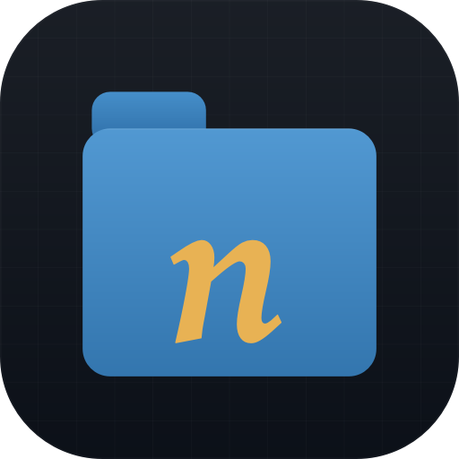
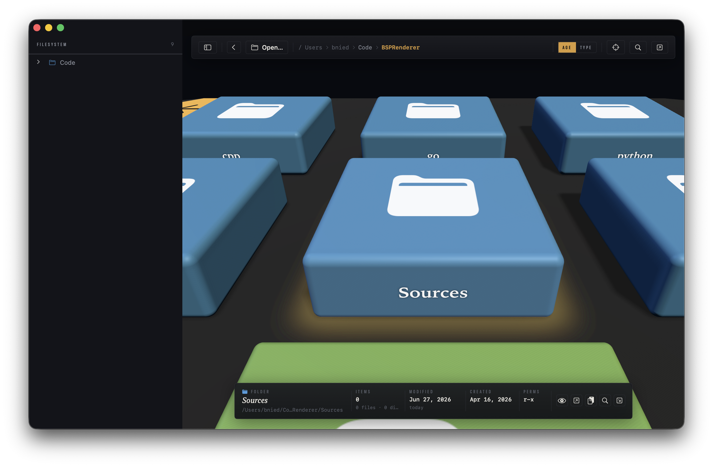

<p align="center">
  
</p>

# neofsn

> **Status: beta.** neofsn is under active development. Expect rough edges, changing behavior, and the occasional bug.
>
> **Requires macOS 14 (Sonoma) or later.**

A spatial filesystem navigator for macOS — a modern homage to SGI's **FSN** (the "File System Navigator" famously shown as the 3D UNIX interface in *Jurassic Park*). Folders become blue platforms, files become flat slabs you fly through, and a warm volumetric spotlight marks whatever you've selected. Built with SwiftUI for the shell and SceneKit for the 3D scene.

> *"It's a UNIX system. I know this."*



## Features

- **3D folder visualization.** Each folder is a plate; its files are flat slabs and its subfolders are raised macOS-blue platforms carrying their own contents.
- **Fly camera.** WASD / arrow keys to move, `Q`/`E` to change altitude, drag to look, scroll to dolly. Hold `Shift` to move faster.
- **Configurable coloring** — toggle between **age heat-map** (FSN-style: red this week → through orange, yellow, green, teal, blue → purple for >1 year) and **file-type palette** (categorical: code, images, audio, video, docs, archives, config, …). Switch live from the top bar; the scene recolors in place without a rescan.
- **File-type icons** stamped on each slab using a shared `FileKind` taxonomy that drives both the icon and the type-mode color.
- **Layered descent.** Stepping into a subfolder drops a new plate beside-and-below the current one and pans the camera to it — the parent stays on screen, so you keep your bearings instead of losing context to a full redraw.
- **Hierarchical sidebar** mirroring the tree, with two-way sync: pick something in 3D and the sidebar scrolls to it; click in the sidebar and the camera flies to it.
- **Interactive breadcrumb bar** — jump to any ancestor folder with a click.
- **FSN-style selection spotlight.** The selected item gets a translucent warm volumetric cone of light descending from above, a glowing halo on the floor around its base, and a subtle illumination on the item itself — the app's signature visual.
- **Expanded metadata HUD** with kind chip, name, full path, size (or file/subdir count for folders), modified/created dates, permissions (`rwx`), and age — plus an inline action strip: Quick Look, Open, Copy Path (`⇧⌘C`), Reveal in Finder, and Descend (for folders).
- **Finder integration & Quick Look** — open in the default app (`⇧⌘O`), reveal in Finder (`⌘R`), copy path (`⇧⌘C`), or press `Space` to Quick Look the selection.
- **Reset view** (`⌘0`, the scope button, or click empty space) re-frames the current folder.

## Requirements

- macOS 14.0 (Sonoma) or later — this is the app's minimum deployment target
- Xcode 26 or later to build (the project uses file-system–synchronized groups)

## Building

Open `neofsn.xcodeproj` in Xcode and build, or from the command line:

```sh
xcodebuild -project neofsn.xcodeproj -scheme neofsn -configuration Debug build
```

## Running

The easiest way is to open `neofsn.xcodeproj` in Xcode and press **Run** (`⌘R`).

To launch a command-line build directly, open the product Xcode just built:

```sh
open "$(xcodebuild -project neofsn.xcodeproj -scheme neofsn -configuration Debug \
  -showBuildSettings 2>/dev/null | awk '/ BUILT_PRODUCTS_DIR /{d=$3} END{print d}')/neofsn.app"
```

On first launch the 3D view is empty. Click **Open…** (or press `⌘O`) and choose a folder to visualize. The app is sandboxed and uses security-scoped bookmarks, so it only ever reads the folders you explicitly pick. Once a folder is open, fly around with the keyboard and mouse (see below), click items to inspect them, and step into subfolders to descend.

## Keyboard & mouse

| Action | Binding |
| --- | --- |
| Move / strafe | `W` `A` `S` `D` or arrow keys |
| Altitude | `E` (up) / `Q` (down) |
| Speed boost | hold `Shift` |
| Look around | left- or right-drag |
| Dolly | scroll |
| Select / enter | single-click |
| Open file / re-root folder | double-click |
| Quick Look | `Space` |
| Open in default app | `⇧⌘O` |
| Reveal in Finder | `⌘R` |
| Copy path | `⇧⌘C` |
| Open folder… | `⌘O` |
| Back | `⌘[` |
| Reset view | `⌘0` |

## Project layout

```
neofsn/
├── neofsnApp.swift          # App entry point
├── ContentView.swift        # NavigationSplitView shell, toolbar, breadcrumbs, empty state
├── BrowserViewModel.swift   # Navigation state, scanning, selection, focus requests
├── QuickLookPreview.swift   # QLPreviewPanel bridge
├── Model/
│   ├── FileKind.swift           # File-type taxonomy (icon symbols + type-mode palette)
│   ├── FileSystemNode.swift     # Tree node model
│   └── FileSystemScanner.swift  # Async directory scanner
├── Scene/
│   ├── SceneBuilder.swift       # Builds level plates, slabs, icons, labels
│   ├── SceneHostView.swift      # SCNView host, level stack, picking, framing
│   └── FlyCameraController.swift# WASD/look/scroll fly camera
└── UI/
    ├── SidebarView.swift        # Hierarchical tree sidebar
    ├── MetadataHUD.swift        # Selected-item metadata panel
    └── Theme.swift              # Color, type, and panel design tokens

scripts/
├── generate-icon.swift          # Renders the app icon set
└── gen-compile-commands.sh      # Generates compile_commands.json for sourcekit-lsp
```

## Tooling notes

The project is a hand-authored `.xcodeproj` (no SwiftPM manifest). For editors that use `sourcekit-lsp`, run `scripts/gen-compile-commands.sh` to generate a `compile_commands.json` so cross-file symbols resolve. The build itself always goes through `xcodebuild` / Xcode.

## Acknowledgements

Inspired by Silicon Graphics' *fsn* (1992) and its cameo in *Jurassic Park*. This is an independent reimplementation and is not affiliated with SGI.

## License

BSD 2-Clause. See [LICENSE](LICENSE).
